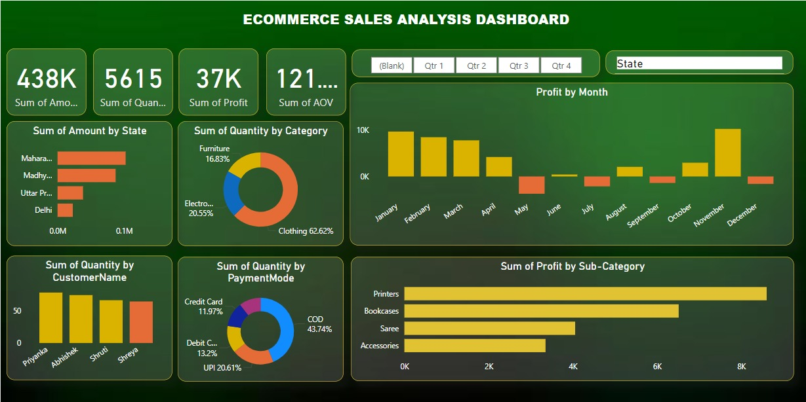
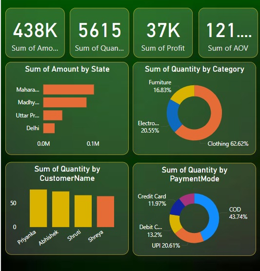
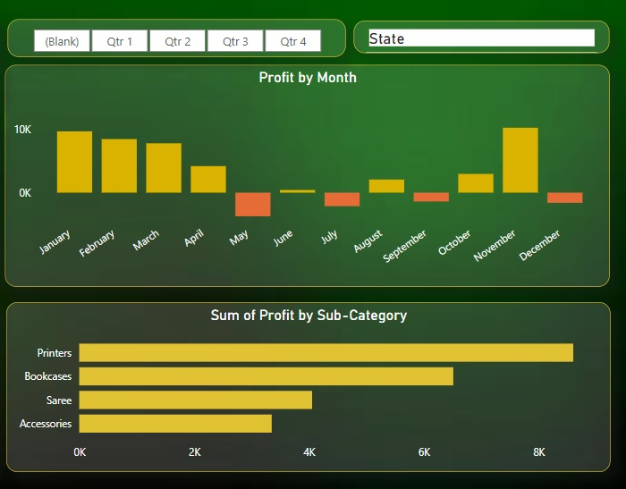

# Ecommerce Sales Analysis Dashboard

A comprehensive *sales analysis dashboard* created using Power BI, designed to provide insights into the performance and profitability of an ecommerce business. The dashboard highlights key metrics such as total sales, profits, and analytics to help in making data-driven decisions.

### ➡️ *Home Page*

The *Home Page* offers a high-level overview of the ecommerce sales performance, including total sales, number of orders, average order value, and total customers. It provides a snapshot of the business’s health, allowing stakeholders to quickly assess the company’s progress.

### ➡️ *Profit Charts*

The *Profit Charts* section offers a detailed view of profitability across different time periods, products, and regions. This helps in identifying which areas are generating the most profit and where there might be room for improvement.

### ➡️ *Analytics*

The *Analytics* section provides a deeper understanding of sales patterns, customer behavior, and marketing impact. This section enables business stakeholders to forecast future trends and plan strategies accordingly.

### Dashboard Summary:
This Power BI dashboard delivers valuable insights through intuitive visualizations, enabling quick and effective decision-making. It can help businesses monitor performance, boost profits, and refine their strategies for improved sales outcomes.

---
